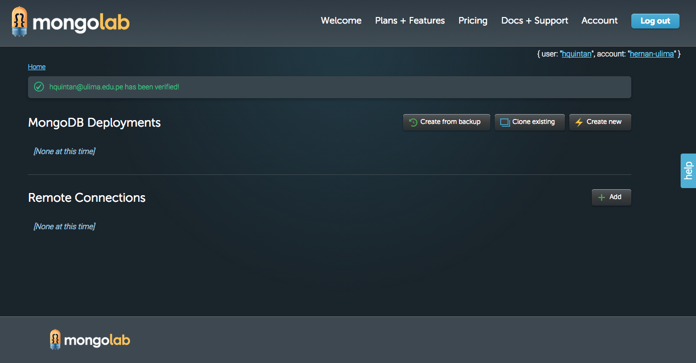
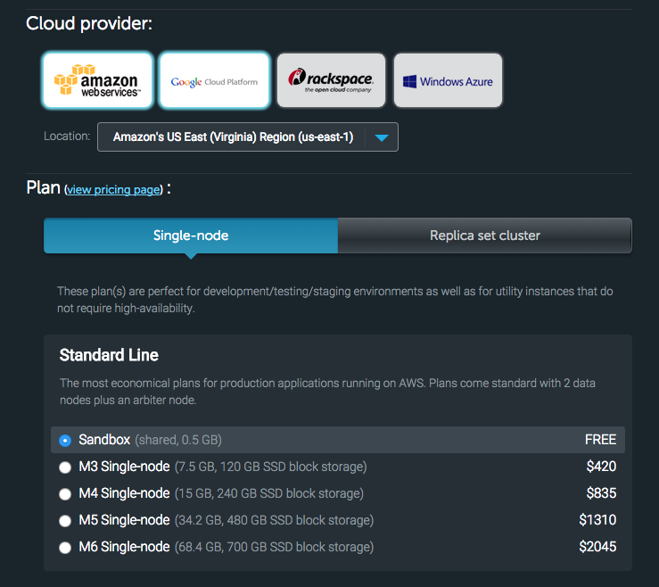
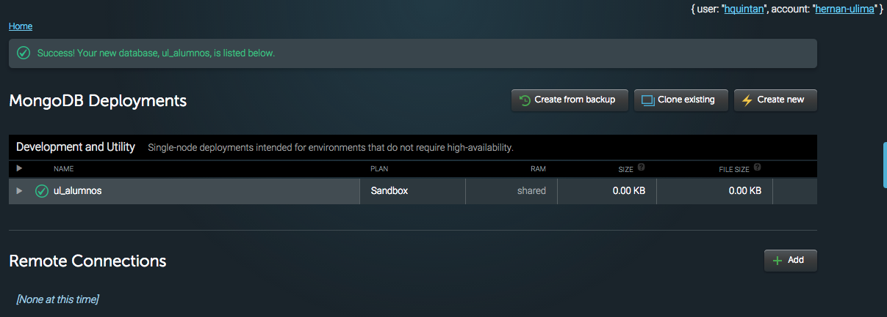
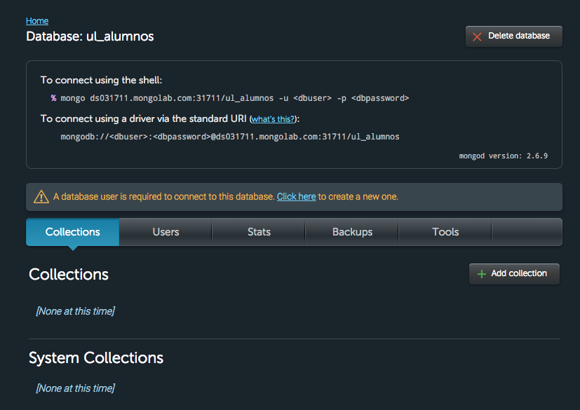
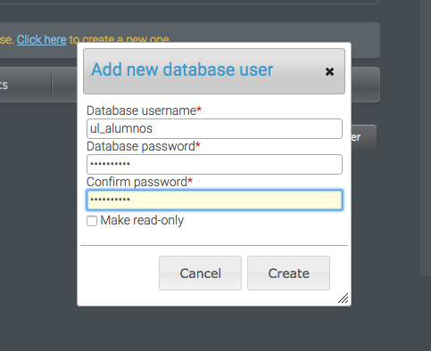
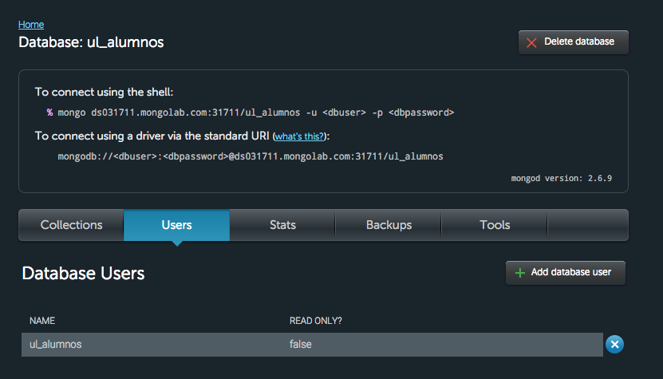
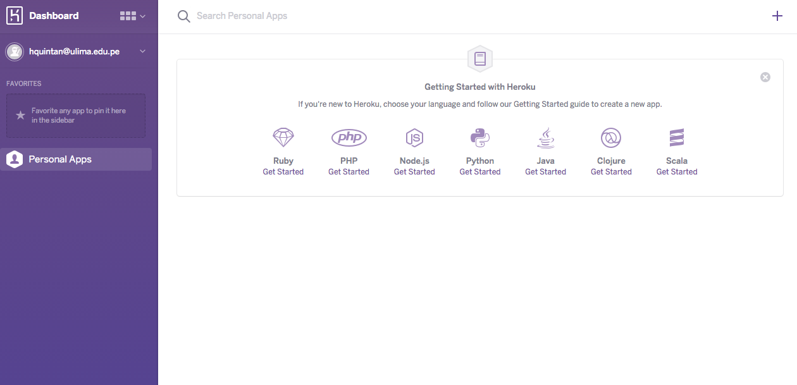
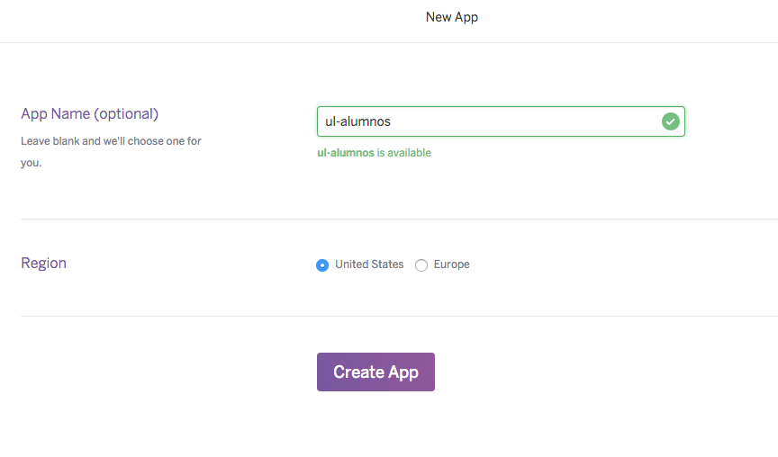

Taller Cloud Heroku
===================

== Prerrequisitos

* Descargar la aplicación desde github: https://github.com/ulima/pi-taller-cloud
* Tener instalado el cliente mongodb.
* Creación de cuenta en servicio mongolab (https://mongolab.com)
* Creación de cuenta en servicio heroku,
* Tener heroku toolbelt instalado (https://toolbelt.heroku.com)

== Creación y configuración de base de datos MongoDB

Al verificar su cuenta de mongo, se le dirige a la siguiente página:

Crear una nueva base de datos haciendo click en la opción "Create new".

Dentro de la pantalla "_Create new subscription_", llenar lo siguiente:

* Cloud provider: _Amazon's US East_
* Seleccionar _Single Node_ y luego la opción de _Sandbox_.
* MongoDB version: _2.6.x_
* Database name: _ul_alumnos_ (pueden poner el nombre que crean conveniente)
* Hacer click en el botón "_Create new MongoDB deployment_".

WARNING: Asegurarse que el Price sea _$0 / month_

Si todo estuvo correcto, se tendrá la siguiente pantalla:

Hacemos click en la base de datos ul_alumnos. Con esto se muestra el detalle de
la base de datos.

* En la parte superior, se muestran los datos para realizar conexiones.
* En la parte inferior, se ven las colecciones que tiene la base de datos, así
como los usuarios registrados, estadísticas, etc.

Para poder conectarnos desde una aplicación externa (sea un cliente mongo en
shell o nuestra webapp), debemos crear un usuario. Para esto hacemos click en
la pestaña "_Users_" y luego el botón "_Add database user_".

En esta pantalla se debe poner el nombre de usuario (ul_alumnos) y su password
(ul_alumnos). Posteriormente hacer click en el botón "_Create_".

TIP: Si es que se chequea la opción "_Make read-only_", el acceso a la base de
datos con el usuario creado solo será de lectura.

Si todo estuvo correcto, se verá lo siguiente:

== Conexión desde línea de comandos (shell)

Desde línea de comandos (shell) y utilizando los datos de la imagen anterior,
poner el siguiente comando:

[source]
----
hernan$ ds031711.mongolab.com:31711/ul_alumnos -u ul_alumnos -p ul_alumnos
----

Siendo:

* host: ds031711.mongolab.com
* port: 31711
* base de datos: ul_alumnos

Si todo estuvo correcto, se verá el prompt del mongodb.

[source]
----
hernan$ ./mongo ds031711.mongolab.com:31711/ul_alumnos -u ul_alumnos -p ul_alumnos
MongoDB shell version: 2.6.5
connecting to: ds031711.mongolab.com:31711/ul_alumnos
rs-ds031711:PRIMARY>
----

Ahora procederemos a importar los documentos necesarios para el laboratorio.

Desde la línea de comandos (shell), importaremos los datos de la colección
alumnos.json. Para esto, teclear lo siguiente:

[source]
----
hernan$ ./mongoimport -h <host>:<port> -u <usuario> -p <password> -d ul_alumnos -c alumnos --file alumnos.json
----

Si todo estuvo correcto, saldrá los siguiente:

[source]
----
hernan$ ./mongoimport -h <host>:<port> -u <usuario> -p <password> -d ul_alumnos -c alumnos --file alumnos.json
connected to: <host>:<port>
2015-06-30T14:48:37.691-0500 imported 3 objects
----

Ahora procederemos a importar la colección carreras.

[source]
----
hernan$ ./mongoimport -h <host>:<port> -u ul_alumnos -p ul_alumnos -d ul_alumnos -c carreras --file carreras.json
----

Si todo estuvo correcto, saldrá los siguiente:

[source]
----
hernan$ ./mongoimport -h <host>:<port> -u ul_alumnos -p ul_alumnos -d ul_alumnos -c carreras --file carreras.json
connected to: <host>:<port>
2015-06-30T14:56:44.402-0500 imported 3 objects
----

== Configuración de conexión a base de datos MongoDB desde Webapp

Verificar la clase Configuracion y modificar los parámetros con los de su base
de datos Mongo.

[source, java]
----
package pe.edu.ulima.ulalumnos.model;

public class Configuracion {
    public static final String MONGO_USER = "ul_alumnos";
    public static final String MONGO_PASSWORD = "ul_alumnos";
    public static final String MONGO_URI =
            "mongodb://" + MONGO_USER +":" + MONGO_PASSWORD +
            "@ds031711.mongolab.com:31711/ul_alumnos";
}
----

== Subir webapp a la nube (Heroku)

=== Creación de aplicación dentro de Heroku

Entrar a www.heroku.com y loguearse. A continuación visualizará la siguiente
pantalla:

Procedamos a crear una nueva aplicación, para esto, hacer click en el "+" que
se encuentra en la parte superior derecha.

Tras esto, se mostrará la pantalla de "_New App_". Llenar con los datos de su
aplicación, para luego presionar el botón "_Create App_".

IMPORTANT: Se sugiere poner un nombre a la aplicación en el campo "_App Name_",
caso contrario, Heroku le asignará un nombre por defecto.

=== Creación de WAR y configuración de app

=== Instalar el heroku-deploy

Luego de haber descargado el heroku toolbelt, desde línea de comandos,
escribir lo siguiente:

[source]
----
hernan$ heroku plugins:install https://github.com/heroku/heroku-deploy
----

=== Subir webapp a Heroku

Desde la línea de comandos, escribimos lo siguiente:

[source]
----
hernan$ heroku deply:war --war <ruta_a_war>/ULAlumnos.war --app ul-alumnos
----

=== Comprobamos que nuestra webapp haya sido correctamente subida

En un navegador, ingresamos la siguiente URL:

http://ul-alumnos.herokuapp.com/

Y debemos tener la siguiente pantalla:

